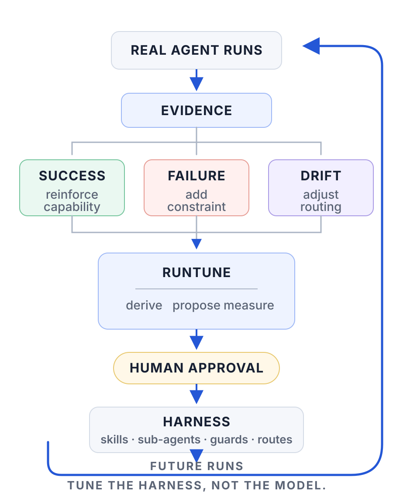

# RunTune

**Your agents already generate the data needed to improve their runtime. RunTune closes the loop.**

[](https://github.com/kkrlstrm/runtune/actions/workflows/test.yml)
 


<p align="center">
  <picture>
    <source media="(max-width: 600px)" srcset="docs/runtune-loop-mobile.svg?v=1068f32">
    
  </picture>
</p>

RunTune is a runtime learning loop for coding agents. It turns real Claude Code, Codex, Cursor,
Antigravity and model-router runs into governed changes to the system around them.

- **Success → capability.** Working patterns that repeat become skills, CLI paths, specialized
  sub-agents, or better routes.
- **Failure → constraint.** Failures that repeat become guard rules and routing checks.
- **Change → measurement.** Every adopted change is measured against a control, then kept,
  reviewed, or retired.

**It tunes the harness, not the model.** RunTune doesn't teach an agent to remember yesterday.
It changes tomorrow's runtime based on what happened yesterday.

No weight training, and no autonomous self-modification: RunTune proposes evidence-backed
changes, and a human decides what enters the runtime.

## The loop, and what it tunes

A coding agent is a model inside a harness: the skills it can load, the sub-agents it can spawn,
the guards on its tools, and the routes its model calls take. The model is someone else's to
train; the harness is yours to tune.

This is the difference from agent memory: the next agent runs in a different environment,
whether or not it recalls anything.

## Observability should close the loop

Most agent observability ends at a dashboard: runs → traces → a person reads the dashboard.
Traces tell you what happened. RunTune asks what the runtime should learn from it, turns the
answer into a gated, approved change, and then checks on future runs whether the change worked.

## Try it in 60 seconds

```bash
pip install git+https://github.com/kkrlstrm/runtune    # zero dependencies
runtune demo                    # the whole loop on a synthetic trace, in a temp dir

runtune record claude           # backfill your Claude Code history (~/.claude/projects)
runtune record codex            # and/or Codex (~/.codex/sessions)
runtune record cursor           # and/or Cursor's agent (its local state.vscdb)
runtune record antigravity      # and/or Antigravity (~/.gemini/antigravity/brain)
runtune notify                  # one digest: a card + numbered proposals, with a desktop notification
runtune show --open             # read it
runtune reply 1,3               # approve items 1 and 3; the rest are snoozed for 28 days
```

This uses only the transcripts already on your machine: no accounts, no database, no network.
To keep it running, `runtune install` prints the hook for Claude Code, Codex, Cursor and Antigravity (you
paste it, because RunTune never edits host settings), and `runtune schedule --install` sends a
weekly digest, reading Cursor's store first when Cursor is installed.

## From local loop to continuous operation

RunTune can stay on your laptop, or run continuously around a deployed agent system. On a small
VM it reads evidence from a shared telemetry database that your agents' recorders write to
([warehouse sources](docs/WAREHOUSE.md)), snapshots the model provider's bill daily, and derives
and reviews weekly. It sends each digest to Slack or email, and every hour it checks for a
decision. The first valid answer on any channel wins, and
the other channels are told it was handled. An approved change becomes a branch and a pull
request against the agent's harness, and measurement starts only once that change is merged.

```
AGENT RUNS
    ↓
 EVIDENCE
    ↓
 RUNTUNE ─────→ Slack / email
    ↑                ↓
    │          human decision
    │                ↓
    └── future runs ← merge ← PR ← approved change
```

RunTune needs permission to open a pull request, not to change what is deployed. Git remains
the deployment boundary. [Channels and deployment →](docs/CHANNELS.md)

## What it can change

| from | artifact | what it writes |
|---|---|---|
| repeated failure | **constraint** | a guard rule, capped at what its failure rate supports (nudge, deny, or block) |
| repeated success | **capability** | a `SKILL.md` naming the commands that have worked, for code agents keep re-deriving |
| isolated, repeated work | **sub-agent** | a purpose-built agent type, granted exactly the tools its predecessors used |
| approved vs. ran vs. billed | **route** | a routing check or a retired clearance; a cheaper model always requires an eval first |

Each proposal is compiled to the narrowest artifact that works: a rule if a rule will do, a
sub-agent only if a skill won't. Each proposal also records why the narrower options were
rejected.

## Run it before you apply it

A staged skill or sub-agent can be run before anyone approves it. `runtune verify` runs the
agent headless (Claude Code or Codex; Cursor and Antigravity once their selftest passes) on
tasks drafted from your own sessions or written by you, once against the repository as it is
and once with the draft in place, in a contained copy of the repository: no network,
credentials unreadable, nothing written to the real repo. It reports `pass`, `no-effect`, `fail` or `inconclusive`, tested with
Fisher's exact test, and tells you before it starts whether your run count can reach
significance at all.

```bash
runtune verify <id> --static     # free: do the commands the skill names exist?
runtune verify --selftest --host codex   # prove the containment for a host on this machine
runtune verify <id> --init       # task file, with tasks drafted from recorded sessions to review
runtune verify <id>              # control vs treatment
runtune apply <id> --approve alice --eval .runtune/verify/<id>/result-<ts>.json
```

`apply` accepts a result only for the exact draft that passed, against an unchanged target. A
route's `--eval` must be a result about that mode, that candidate and the model it replaces.
[How verify works and what it cannot tell you →](docs/VERIFY.md)

## Why it can't run away

- **There is one write boundary.** The promoter is the only RunTune component that changes the
  harness. Derivers, measurement and notifications can propose changes but have no code path
  to apply them; a test enforces that only the two approval paths (the `apply` command and a
  parsed human reply) can reach the promoter. This is an architectural separation, not an
  instruction to a model.
- **The learner doesn't need the agent's authority.** It only reads evidence: transcripts, the
  provider's bill, and a database it opens in read-only sessions (give it a SELECT-only role).
  Every change goes through a separate approval and promotion path.
- **It can't widen its own boundaries.** Loosening a rule, broadening a tool grant, or admitting
  a model needs a written reason, and for models a passing eval. None of these can be approved
  with a one-word reply.
- **A test result is tied to what it tested.** A `runtune verify` result passed to `apply`
  must be a pass, for that artifact, for that exact draft, against that version of the target.
  `require_verify` in `authority.json` makes one mandatory for skills and sub-agents.
- **Its evidence sets a ceiling.** A failure that happens 30% of the time can earn a nudge, never
  a block.
- **It only edits what it wrote.** It never overwrites a file a person wrote, and it refuses a
  proposal whose target changed after the proposal was reviewed.
- **It stays out of host settings.** The promoter refuses host settings, hook wiring and git
  internals as targets, whoever approves. Every decision goes into a hash-chained ledger.
- **Ambiguous answers get a question back.** "All but number three" is never read as "all".

## Evidence

RunTune was developed against about 238,000 recorded tool calls and model requests from one
team's production agents: 150 days of Claude Code, Codex and OpenRouter traffic, plus 17,410
sub-agent runs. It found:

- repeated work that should be a reusable capability, including an existing CLI that served
  only 28% of the need it was built for;
- generic sub-agents doing work better suited to narrow, purpose-built ones;
- model traffic bypassing the approved router, which was traced to a helper and fixed;
- guard rules that helped, rules that stopped helping, and one that made failures worse until
  it was rewritten.

**RunTune was wrong too.** Five of its recommendations changed once checked against production:

- two apparent routing violations were a clearance-day transition and a benchmark;
- one "harmful" rule had already been fixed by its rewrite;
- a generated rule could never have fired;
- a generated skill named a command path that didn't exist.

Each mistake became a regression test, and the evidence doc keeps the wrong versions. A live
experiment on one proposal came back inconclusive, and that result is published too.

[Read the evidence and methodology →](docs/EVIDENCE.md)

## How it works

Record → derive → gate → apply → review. Evidence comes from RunTune's own hook, a transcript
backfill, the router's call log and the provider's bill. Every cluster is graded against its
denominator, and anything withheld is reported with its reason. The promoter carries out only
what a person approved, and review measures each change against a control.

Details: [how it works](docs/HOW-IT-WORKS.md) · [channels and deployment](docs/CHANNELS.md) ·
[warehouse sources](docs/WAREHOUSE.md) · [extending it](docs/EXTENDING.md).

## What this is not

**Not a sandbox.** Constraints run as tool-call hooks; for isolation, run agents inside an OS
sandbox, and RunTune inside that. The measurement caveats (observational rates, `ok` is not
quality, derivers are counters) are in [the evidence doc](docs/EVIDENCE.md#limits).

## Lineage

RunTune merges three projects that each covered part of this loop. See
[docs/LINEAGE.md](docs/LINEAGE.md) for what came from each, and why some ideas were changed
or left out.

- **[CallusGuard](https://github.com/kkrlstrm/callusguard):** the failure side. Contributes
  failure tiers with action ceilings, the rule lifecycle, the probe-vs-prune distinction, and
  the hash-chained audit log, all ported. RunTune has its own recorder and enforcement hook and
  does not depend on CallusGuard. Its rulesets use the same shape, so either tool can enforce
  them.
- **[autoharness](https://github.com/tigerless-labs/autoharness) (MIT):** the success side for
  Claude Code. Contributes the split where a model proposes and deterministic code writes,
  content-addressed evidence, use-rate against opportunity, merge versus death in the ledger,
  and the rule that RunTune only ever touches files it wrote.
- **[AutoRefine](https://github.com/AutoRefine/Autorefine)** ([arXiv 2601.22758](https://arxiv.org/abs/2601.22758)):
  typed artifacts. Contributes the rule → skill → subagent compile order, correction plus
  preservation evidence, the replay gate, revisions that inherit their predecessors' cases,
  declared lineage, and suppressed gates that still record their verdict. These are
  reimplemented; no code was copied, because that repo ships without a license file.

## Contributing

See [CONTRIBUTING.md](CONTRIBUTING.md). Results from your own agents, null results included, are welcome.

## License

Apache-2.0. Copyright (C) 2026 Kai Karlstrom. See [NOTICE](NOTICE) for third-party credits.
